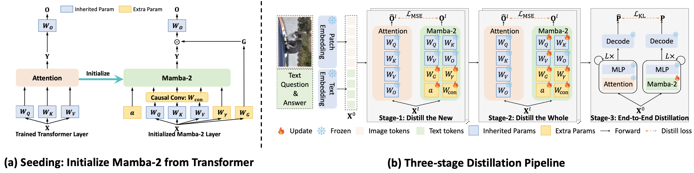

<div align="center">

<h1>mmMamba</h1>
<h3>Decoder-only Multimodal State Space Model via Quadratic to Linear Distillation</h3>

[Bencheng Liao](https://github.com/LegendBC)<sup>1,2</sup>, [Hongyuan Tao](https://github.com/Hongyuan-Tao)<sup>2</sup>, [Qian Zhang](https://scholar.google.com/citations?user=pCY-bikAAAAJ&hl=zh-CN)<sup>3</sup>, [Tianheng Cheng](https://scholar.google.com/citations?user=PH8rJHYAAAAJ&hl=en)<sup>2</sup>,  [Yingyue Li](https://github.com/Yingyue-L)<sup>2</sup>,  Haoran Yin<sup>3</sup>, [Wenyu Liu](https://scholar.google.com/citations?user=D7jDk7gAAAAJ&hl=en)<sup>2</sup>, [Xinggang Wang](https://xwcv.github.io)<sup>2 :email:</sup>
 
<sup>1</sup> Institute of Artificial Intelligence, HUST, <sup>2</sup> School of EIC, HUST, <sup>3</sup> Horizon Robotics

(<sup>:email:</sup>) corresponding author, xgwang@hust.edu.cn


[](https://arxiv.org/abs/2411.xxx)&nbsp;
[](https://huggingface.co/hustvl/mmMamba)&nbsp;


</div>

## News
* **` Nov. 25th, 2024`:** We released our paper on [Arxiv](https://arxiv.org/abs/2411.15139). We release the initial version of [code]() and [weight]().


## Table of Contents
- [Introduction](#introduction)
- [Getting Started](#getting-started)
- [Acknowledgement](#acknowledgement)
- [Citation](#citation)

## Introduction
We propose mmMamba, the first decoder-only multimodal state space model via quadratic to linear distillation recipe with moderate academic computation resources. Unlike the existing linear-complexity encoder-based multimodal large language models (MLLMs), mmMamba get rid of the separate vision encoders and under-performing pre-trained RNN-based LLMs. By distilling from the quadratic-complexity Transformer-based pre-trained MLLMs with the proposed seeding strategy and three-stage distillation recipe, mmMamba effectively transfers the knowledge and preserves the multimodal capabilities. Furthermore, mmMamba supports flexible hybrid architectures that combine Transformer and Mamba layers for customizable efficiency-performance trade-offs. 

Distilled from the Transformer-based decoder-only HoVLE, the pure Mamba-2-based linear-complexity mmMamba-linear achieves competitive performance against existing linear and quadratic-complexity VLMs, while mmMamba-hybrid further improves performance significantly, approaching HoVLE's capabilities. At 103K tokens, mmMamba-linear demonstrates 20.6x speedup and 75.8\% GPU memory reduction compared to HoVLE, while mmMamba-hybrid achieves 13.5x speedup and 60.2\% memory savings.

<div align="center">


<b>Seeding strategy and three-stage distillation pipeline of mmMamba.</b>

</div>


## Getting Started

- [Getting started](docs/getting_started.md)
- [Preparation of mmMamba environment](docs/install.md)
- [Training and Evaluation](docs/train_eval.md)

## Acknowledgement
mmMamba is greatly inspired by the following outstanding contributions to the open-source community: [mamba](hhttps://github.com/state-spaces/mamba), [LolCATs](https://github.com/HazyResearch/lolcats), [phi-mamba](https://github.com/goombalab/phi-mamba), [MambaInLlama](https://github.com/jxiw/MambaInLlama), [HoVLE](https://huggingface.co/OpenGVLab/HoVLE),[SOLO](https://github.com/Yangyi-Chen/SOLO).

## Citation
If you find mmMamba is useful in your research or applications, please consider giving us a star 🌟 and citing it by the following BibTeX entry.

```bibtex
 @article{mmMamba,
  title={mmMamba: Decoder-only Multimodal State Space Model via Quadratic to Linear Distillation},
  author={Bencheng Liao and Hongyuan Tao and Qian Zhang and Tianheng Cheng and Yingyue Li and Haoran Yin and Wenyu Liu and Xinggang Wang},
  journal={arXiv preprint arXiv:2502.XXXXX},
  year={2025}
}
```
